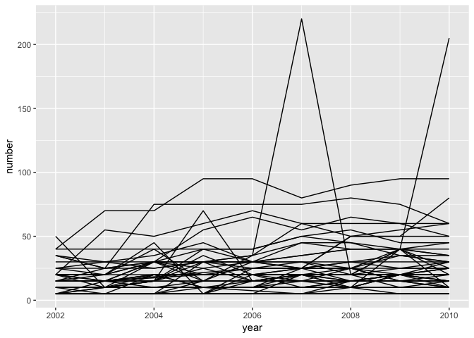

p8105\_hw2\_hn2339
================
Haowei Ni
2018/10/7

``` r
library(tidyverse)
```

    ## ─ Attaching packages ──────────────────────── tidyverse 1.2.1 ─

    ## ✔ ggplot2 3.0.0     ✔ purrr   0.2.5
    ## ✔ tibble  1.4.2     ✔ dplyr   0.7.6
    ## ✔ tidyr   0.8.1     ✔ stringr 1.3.1
    ## ✔ readr   1.1.1     ✔ forcats 0.3.0

    ## ─ Conflicts ────────────────────────── tidyverse_conflicts() ─
    ## ✖ dplyr::filter() masks stats::filter()
    ## ✖ dplyr::lag()    masks stats::lag()

``` r
library(dplyr)
```

Question 1
----------

``` r
library(p8105.datasets)
    data(brfss_smart2010) 
    # clean the name to lower case
    BRFSS = janitor::clean_names(brfss_smart2010) %>% 
    # focus on overall health and 2002 
    filter(topic == "Overall Health") %>%
    mutate(response = forcats::fct_relevel(response, c("Excellent", "Very good", "Good", "Fair", "Poor"))) %>%
    filter(year == "2002") %>%
    # find state observed in seven locations 
    group_by(locationabbr, locationdesc) %>%
    summarize(number = n()) %>%
    group_by(locationabbr) %>%
    summarize(number = n()) %>%
    filter(number == 7)
    #CT, FL, NC
```

The states that are observed at seven places are CT, FL, NC

``` r
library(p8105.datasets)
    data(brfss_smart2010) 
    # clean the name to lower case
    observation = janitor::clean_names(brfss_smart2010) %>% 
    # focus on overall health 
    filter(topic == "Overall Health") %>%
    mutate(response = forcats::fct_relevel(response, c("Excellent", "Very good", "Good", "Fair", "Poor"))) %>%
    group_by(year, locationabbr) %>%
    summarize(number = n())
    #make the spaghetti plot 
    ggplot(data = observation, aes(x = year, y = number, group = locationabbr)) +
      geom_line()
```



``` r
library(p8105.datasets)
    data(brfss_smart2010) 
    # clean the name to lower case
    excellent_table = janitor::clean_names(brfss_smart2010) %>% 
    # focus on overall health 
    filter(topic == "Overall Health") %>%
    mutate(response = forcats::fct_relevel(response, c("Excellent", "Very good", "Good", "Fair", "Poor"))) %>%
    group_by(locationabbr) %>%
    filter(locationabbr == "NY") %>%
    filter(year == "2002" | year == "2006" | year == "2010") %>%
    select(-c(class, topic, question, sample_size, confidence_limit_low:geo_location)) %>%
    spread(key = response, value = data_value) %>%
    summarize(mean_excellent = mean(Excellent),
              sd_excellent = sd(Excellent))
```

Question 2
----------

``` r
library(p8105.datasets)
    data(instacart) 
    instacart = janitor::clean_names(instacart)
```

Question 3
----------

``` r
library(p8105.datasets)
    data(ny_noaa) 
    ny_noaa = janitor::clean_names(ny_noaa)
```
