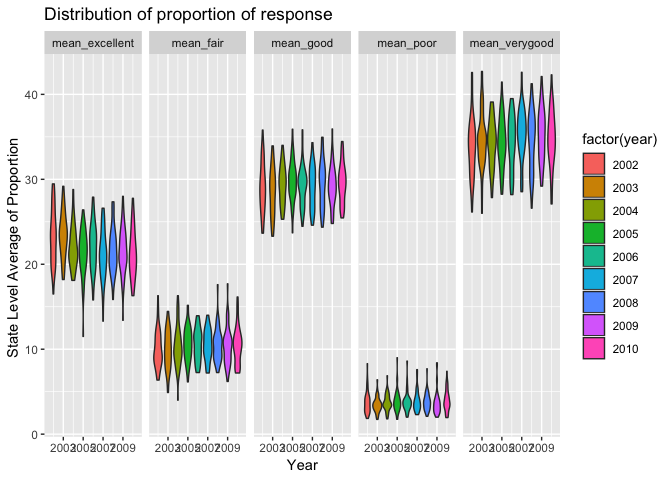
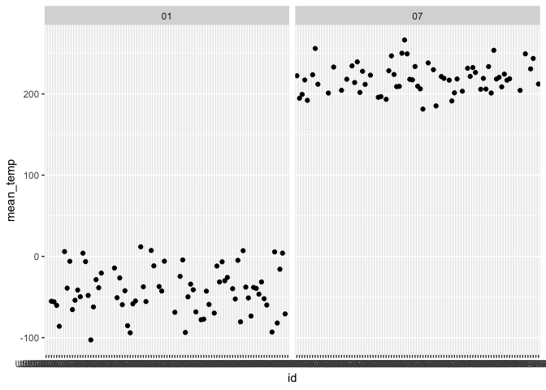
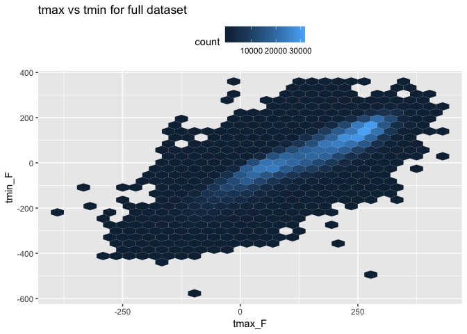

p8105\_hw2\_hn2339
================
Haowei Ni
2018/10/7

``` r
library(tidyverse)
```

    ## ─ Attaching packages ──────────────────────── tidyverse 1.2.1 ─

    ## ✔ ggplot2 3.0.0     ✔ purrr   0.2.5
    ## ✔ tibble  1.4.2     ✔ dplyr   0.7.6
    ## ✔ tidyr   0.8.1     ✔ stringr 1.3.1
    ## ✔ readr   1.1.1     ✔ forcats 0.3.0

    ## ─ Conflicts ────────────────────────── tidyverse_conflicts() ─
    ## ✖ dplyr::filter() masks stats::filter()
    ## ✖ dplyr::lag()    masks stats::lag()

``` r
library(dplyr)
```

Question 1
----------

``` r
library(p8105.datasets)
    data(brfss_smart2010) 
    # clean the name to lower case
    BRFSS = janitor::clean_names(brfss_smart2010) %>% 
    # focus on overall health and 2002 
    filter(topic == "Overall Health") %>%
    mutate(response = forcats::fct_relevel(response, c("Excellent", "Very good", "Good", "Fair", "Poor"))) %>%
    filter(year == "2002") %>%
    # find state observed in seven locations 
    group_by(locationabbr, locationdesc) %>%
    summarize(number = n()) %>%
    group_by(locationabbr) %>%
    summarize(number = n()) %>%
    filter(number == 7)
    #CT, FL, NC
```

The states that are observed at seven places are CT, FL, NC

``` r
library(p8105.datasets)
    data(brfss_smart2010) 
    # clean the name to lower case
    observation = janitor::clean_names(brfss_smart2010) %>% 
    # focus on overall health 
    filter(topic == "Overall Health") %>%
    mutate(response = forcats::fct_relevel(response, c("Excellent", "Very good", "Good", "Fair", "Poor"))) %>%
    group_by(year, locationabbr) %>%
    summarize(number = n())
    #make the spaghetti plot 
    ggplot(data = observation, aes(x = year, y = number, group = locationabbr)) +
      geom_line()
```


``` r
library(p8105.datasets)
    data(brfss_smart2010) 
    # clean the name to lower case
    excellent_table = janitor::clean_names(brfss_smart2010) %>% 
    # focus on overall health 
    filter(topic == "Overall Health") %>%
    mutate(response = forcats::fct_relevel(response, c("Excellent", "Very good", "Good", "Fair", "Poor"))) %>%
    group_by(locationabbr) %>%
    #filter to only NY and year 2002, 2006, 2010 
    filter(locationabbr == "NY") %>%
    filter(year == "2002" | year == "2006" | year == "2010") %>%
    select(-c(class, topic, question, sample_size, confidence_limit_low:geo_location)) %>%
    spread(key = response, value = data_value) %>%
    #make table 
    group_by(year) %>%
    summarize(mean_excellent = mean(Excellent),
              sd_excellent = sd(Excellent),
              )
```

``` r
library(p8105.datasets)
    data(brfss_smart2010) 
    # clean the name to lower case
    five_panel = janitor::clean_names(brfss_smart2010) %>% 
    # focus on overall health 
    filter(topic == "Overall Health") %>%
    mutate(response = forcats::fct_relevel(response, c("Excellent", "Very good", "Good", "Fair", "Poor"))) %>%
    group_by(year, locationabbr) %>% 
    select(-c(class, topic, question, sample_size, confidence_limit_low:geo_location)) %>%
    spread(key = response, value = data_value) %>%
    summarize(mean_excellent = mean(Excellent ),
              mean_fair = mean(Fair),
              mean_good = mean(Good),
              mean_verygood = mean(`Very good`),
              mean_poor = mean(Poor)) %>%
    gather(key = mean_value, value = mean_proportion, mean_excellent : mean_poor)
    ggplot(five_panel, aes(x= mean_proportion, fill = mean_value)) + 
  geom_density() +
  facet_grid(~mean_value)
```

    ## Warning: Removed 21 rows containing non-finite values (stat_density).



Question 2
----------

``` r
library(p8105.datasets)
    data(instacart) 
    # find the distinct aisle 
    aisle_distinct = distinct(instacart, aisle, .keep_all = TRUE)  
    most = tail(names(sort(table(instacart$aisle))), 1)
    # make a histogram 
    ggplot(data = instacart, aes(x = aisle_id)) +
      geom_histogram() +
      ggtitle("The number of items ordered in each aisle")
```

    ## `stat_bin()` using `bins = 30`. Pick better value with `binwidth`.

 There are totally 134 in the there. The most ordered item from aisle is fresh vegetables

``` r
instacart %>%
    group_by(aisle, product_name) %>%
    filter(aisle == "baking ingredients" | aisle == "dog food care" | aisle == "packaged vegetables fruits") %>%
    count() %>%
    group_by(aisle) %>% 
    arrange(n) %>%
  filter(min_rank(desc(n)) < 2)
```

    ## # A tibble: 3 x 3
    ## # Groups:   aisle [3]
    ##   aisle                    product_name                                  n
    ##   <chr>                    <chr>                                     <int>
    ## 1 dog food care            Snack Sticks Chicken & Rice Recipe Dog T…    30
    ## 2 baking ingredients       Light Brown Sugar                           499
    ## 3 packaged vegetables fru… Organic Baby Spinach                       9784

``` r
instacart %>%
  filter(product_name == "Coffee Ice Cream" | product_name == "Pink Lady Apple") %>%
  group_by(product_name, order_dow) %>%
  summarize(
    mean = mean(order_hour_of_day)) %>% 
spread(key = order_dow, value = mean)
```

    ## # A tibble: 2 x 8
    ## # Groups:   product_name [2]
    ##   product_name       `0`   `1`   `2`   `3`   `4`   `5`   `6`
    ##   <chr>            <dbl> <dbl> <dbl> <dbl> <dbl> <dbl> <dbl>
    ## 1 Coffee Ice Cream  13.8  14.3  15.4  15.3  15.2  12.3  13.8
    ## 2 Pink Lady Apple   14.4  14.2  13.2   8    11    16    13

Question 3
----------

``` r
library(p8105.datasets)
    data(ny_noaa) 
    # find the most common value in snowfall 
    most_snow = tail(names(sort(table(ny_noaa$snow))), 1)
    ny_noaa = janitor::clean_names(ny_noaa) %>% 
    separate(date, into = c("year", "month", "day"), sep = "-") %>%
    # rename the variable with appropriate unit 
    rename(prcp_mm = prcp, snow_in = snow, tmax_F = tmax, tmin_F = tmin) 
```

The most common observed value in snowfall is 0 . It is because that most of time New York is not in winter season, so there would be no snowfall.

``` r
NY_NOAA = ny_noaa %>%
group_by(id, month) %>%
    filter(month == "01" | month == "07" ) %>%
    mutate(tmax_F = as.numeric(tmax_F, na.rm =TRUE)) %>%
    mutate(tmin_F = as.numeric(tmin_F, na.rm =TRUE)) %>%
    mutate(temp = (tmax_F + tmin_F)/2 ) %>%
    summarize(mean_temp = mean(temp)) %>%
    na.omit(mean_temp) 
    #make a histogram 
    ggplot(NY_NOAA, aes(x = id, y = mean_temp)) +
      geom_point() +
      facet_grid(~month) +
      viridis::scale_fill_viridis(discrete = TRUE)
```

 There is no outliers in the January and July graph. But since the station has very long name, the xlab is hard to be interpretable.

``` r
  ny_noaa %>%
  na.omit(tmax_F) %>% 
  na.omit(tmin_F) %>%
  mutate(tmax_F = as.numeric(tmax_F, na.rm =TRUE)) %>% 
  mutate(tmin_F = as.numeric(tmin_F, na.rm =TRUE)) %>% 
  ggplot(aes(x = tmax_F, y = tmin_F)) +
  geom_hex() +
  ggtitle("tmax vs tmin for full dataset") +
  theme(legend.position = "top")
```



``` r
NY_plot = ny_noaa %>% 
  filter(snow_in > 0, snow_in < 100) 
  ggplot(NY_plot, aes(x = snow_in, fill = year)) + 
  geom_density(alpha = 0.5)
```


