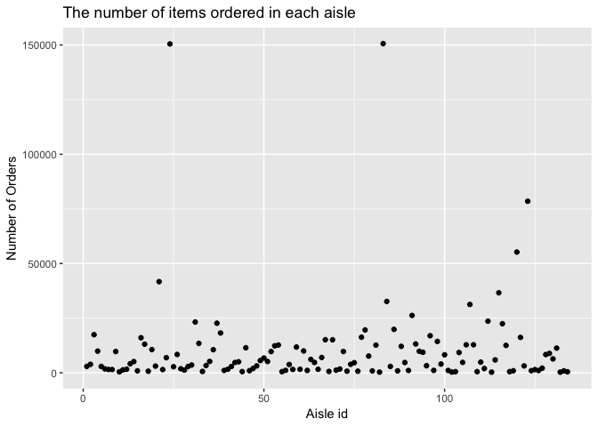
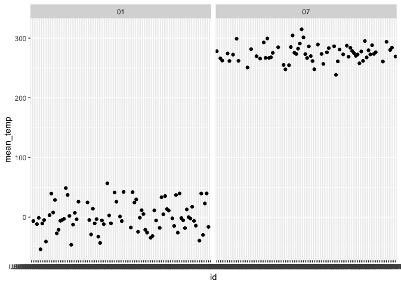
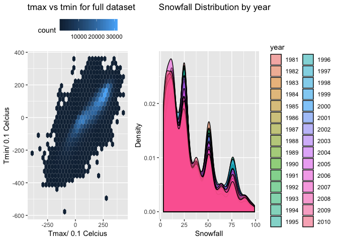

p8105\_hw3\_hn2339
================
Haowei Ni
2018/10/7

Question 1
----------

``` r
library(p8105.datasets)
    data(brfss_smart2010) 
    # clean the name to lower case
    BRFSS = janitor::clean_names(brfss_smart2010) %>% 
    # focus on overall health and 2002 
    filter(topic == "Overall Health") %>%
    mutate(response = forcats::fct_relevel(response, c("Excellent", "Very good", "Good", "Fair", "Poor"))) %>%
    filter(year == "2002") %>%
    # find state observed in seven locations 
    group_by(locationabbr, locationdesc) %>%
    summarize(number = n()) %>%
    group_by(locationabbr) %>%
    summarize(number = n()) %>%
    filter(number == 7)
    # organize the table 
    knitr::kable(BRFSS)
```

| locationabbr |  number|
|:-------------|-------:|
| CT           |       7|
| FL           |       7|
| NC           |       7|

``` r
    #CT, FL, NC
```

The states that are observed at seven places are CT, FL, NC and number is 7.

``` r
library(p8105.datasets)
    data(brfss_smart2010) 
    # clean the name to lower case
    observation = janitor::clean_names(brfss_smart2010) %>% 
    # focus on overall health 
    filter(topic == "Overall Health") %>%
    mutate(response = forcats::fct_relevel(response, c("Excellent", "Very good", "Good", "Fair", "Poor"))) %>%
    group_by(year, locationabbr) %>%
    summarize(number = n())
    #make the spaghetti plot 
    ggplot(data = observation, aes(x = year, y = number, color = locationabbr)) +
      geom_line()
```

 The spaghetti shows that most of the states have number of observations between 0 and 100. Two outliers were also shown in state Florida between year 2006-2008 and 2010.Through the years, there were no big changes among most of the states because the trend line is smooth.

``` r
library(p8105.datasets)
    data(brfss_smart2010) 
    # clean the name to lower case
    excellent_table = janitor::clean_names(brfss_smart2010) %>% 
    # focus on overall health 
    filter(topic == "Overall Health") %>%
    mutate(response = forcats::fct_relevel(response, c("Excellent", "Very good", "Good", "Fair", "Poor"))) %>%
    group_by(locationabbr) %>%
    #filter to only NY and year 2002, 2006, 2010 
    filter(locationabbr == "NY") %>%
    filter(year == "2002" | year == "2006" | year == "2010") %>%
    select(-c(class, topic, question, sample_size, confidence_limit_low:geo_location)) %>%
    spread(key = response, value = data_value) %>%
    #make table 
    group_by(year) %>%
    summarize(mean_excellent = mean(Excellent),
              sd_excellent = sd(Excellent),
              )
    knitr::kable(excellent_table)
```

|  year|  mean\_excellent|  sd\_excellent|
|-----:|----------------:|--------------:|
|  2002|         24.04000|       4.486424|
|  2006|         22.53333|       4.000833|
|  2010|         22.70000|       3.567212|

``` r
library(p8105.datasets)
    data(brfss_smart2010) 
    # clean the name to lower case
    five_panel = janitor::clean_names(brfss_smart2010) %>% 
    # focus on overall health 
    filter(topic == "Overall Health") %>%
    mutate(response = forcats::fct_relevel(response, c("Excellent", "Very good", "Good", "Fair", "Poor"))) %>%
    group_by(year, locationabbr) %>% 
    select(-c(class, topic, question, sample_size, confidence_limit_low:geo_location)) %>%
    spread(key = response, value = data_value) %>%
    summarize(mean_excellent = mean(Excellent ),
              mean_verygood = mean(`Very good`),
              mean_good = mean(Good),
              mean_fair = mean(Fair),
              mean_poor = mean(Poor)) %>%
    gather(key = mean_value, value = mean_proportion, mean_excellent : mean_poor)
    ggplot(five_panel, aes(x= year, y = mean_proportion)) + 
  geom_violin(aes(fill = factor(year))) +
  facet_grid(~mean_value) + 
  ggtitle("Distribution of proportion of response") +
    labs(x = "Year", y = "State Level Average of Proportion ")
```

    ## Warning: Removed 21 rows containing non-finite values (stat_ydensity).

 This is a five panel violin plot. The plot is separated by different responses from Excellent to Poor. From the graph, we can see that the average proportion of "poor" is the lowest, which is below 10. The proportion of "Very good" is the highest. There proportion of each responses were maintained in a relative stable level.

Question 2
----------

``` r
library(p8105.datasets)
    data(instacart) 
    # find the distinct aisle 
    aisle_distinct = distinct(instacart, aisle, .keep_all = TRUE)  
    most = tail(names(sort(table(instacart$aisle))), 1)
```

The data frame contain 1384617 objects and 9 variables. The key variables are product names, aisles and order number/dow. For example, "orgainic hass avocado" is in the "fresh fruit" aisle category. It was ordered on 4th day of the week and 4 in total of number. There are totally 134 in the there. The most ordered item from aisle is fresh vegetables

``` r
 # make a scatterplot
instacart %>% 
    group_by(aisle_id) %>% 
    summarize(number = n()) %>% 
    ggplot(aes(x = aisle_id, y = number)) +
      geom_point() +
      ggtitle("The number of items ordered in each aisle") +
      labs(
        x = "Aisle id",
        y = "Number of Orders"
      )
```

 This is a scatterplot with Aisle id on the x axe and Number of Orders on the y axe. Most of the Aisle ID have order number between 0 ~ 25000. There are several outliers. And 2 of them reached 150000.

``` r
instacart %>%
    group_by(aisle, product_name) %>%
    filter(aisle == "baking ingredients" | aisle == "dog food care" | aisle == "packaged vegetables fruits") %>%
    count() %>%
    group_by(aisle) %>% 
    arrange(n) %>%
  filter(min_rank(desc(n)) < 2) %>% 
    knitr::kable()
```

| aisle                      | product\_name                                 |     n|
|:---------------------------|:----------------------------------------------|-----:|
| dog food care              | Snack Sticks Chicken & Rice Recipe Dog Treats |    30|
| baking ingredients         | Light Brown Sugar                             |   499|
| packaged vegetables fruits | Organic Baby Spinach                          |  9784|

``` r
instacart %>%
  filter(product_name == "Coffee Ice Cream" | product_name == "Pink Lady Apple") %>%
  group_by(product_name, order_dow) %>%
  summarize(
    mean = mean(order_hour_of_day)) %>% 
spread(key = order_dow, value = mean) %>% 
  knitr::kable()
```

| product\_name    |         0|         1|         2|         3|         4|         5|         6|
|:-----------------|---------:|---------:|---------:|---------:|---------:|---------:|---------:|
| Coffee Ice Cream |  13.77419|  14.31579|  15.38095|  15.31818|  15.21739|  12.26316|  13.83333|
| Pink Lady Apple  |  14.40000|  14.20000|  13.20000|   8.00000|  11.00000|  16.00000|  13.00000|

Question 3
----------

``` r
library(p8105.datasets)
    data(ny_noaa) 
    # find the most common value in snowfall 
    most_snow = tail(names(sort(table(ny_noaa$snow))), 1)
    ny_noaa = janitor::clean_names(ny_noaa) %>% 
    separate(date, into = c("year", "month", "day"), sep = "-") %>%
    # rename the variable with appropriate unit 
    rename(prcp_mm = prcp, snow_in = snow, tmax_F = tmax, tmin_F = tmin) 
```

The most common observed value in snowfall is 0 . It is because that most of time New York is not in winter season, so there would be no snowfall.

``` r
NY_NOAA = ny_noaa %>%
group_by(id, month) %>%
    # filter and only select Jan and July 
    filter(month == "01" | month == "07" ) %>%
    mutate(tmax_F = as.numeric(tmax_F, na.rm =TRUE)) %>%
    summarize(mean_temp = mean(tmax_F)) %>%
    na.omit(mean_temp) 
    #make a histogram 
    ggplot(NY_NOAA, aes(x = id, y = mean_temp)) +
      geom_point() +
    # separate the plot into two by months 
      facet_grid(~month) 
```



``` r
    ggplot(NY_NOAA, aes(x = factor(month), y = mean_temp)) +
      geom_boxplot()
```

 There is no outliers in the January and July graph. But since the station has very long name, the xlab is hard to be interpretable.

``` r
  NY_noaa = ny_noaa %>%
  na.omit(tmax_F) %>% 
  na.omit(tmin_F) %>%
  mutate(tmax_F = as.numeric(tmax_F, na.rm =TRUE)) %>% 
  mutate(tmin_F = as.numeric(tmin_F, na.rm =TRUE)) 
  # make a hex gram 
  temp = ggplot(NY_noaa, aes(x = tmax_F, y = tmin_F)) +
  geom_hex() +
  ggtitle("tmax vs tmin for full dataset") +
  theme(legend.position = "top") + 
  labs(x = "Tmax/ 0.1 Celcius",
       y = "Tmin/ 0.1 Celcius")
```

``` r
NY_plot = ny_noaa %>% 
  filter(snow_in > 0, snow_in < 100) 
  snow = ggplot(NY_plot, aes(x = snow_in, fill = year)) + 
  # make a density plot to show the distribution 
  geom_density(alpha = 0.5) +
  ggtitle("Snowfall Distribution by year") + 
    labs(x = "Snowfall",
         y = "Density")
```

``` r
# use patchwork to combine two plots together into a two panel
temp + snow 
```

 The hexagon allows patterns in the data set. It is closer to a circle than the sqaures, so it requires less from orientation bias, and it is more compact, so it therefore provides more accurate sampling. The hexagon tmax vs tmin graph shows that Tmax are between -250 ~ 250(Celcius), Tmin are between -400~400(0.1 Celcius). There are several outliers in the graph. The distribution graph on the right shows that most of the snowfall are between 0 and 25nm because most of the time NY is not in winter season. But it is not a smooth descending line shows that there are some months with unusual high snowfall.
